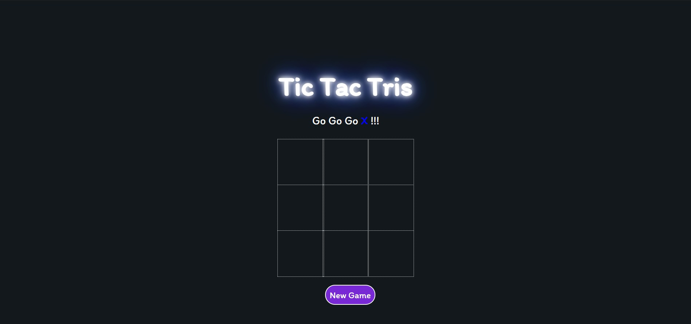
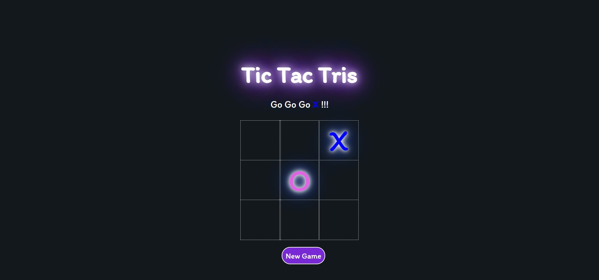

# Tic Tac Tris
> A 1v1 TicTacToe game with a twist. The winning condition is to create one of the tetris pieces.

## Table of contents
* [Rules](#rules)
* [Winning Condition](#winning-condition)
* [In Game Layout](#in-game-layout)
* [Technologies](#technologies)
* [Website Url](#website-url)
* [Status](#status)

## Rules
* X goes first.
* O goes second.
* The first player to create a tetris piece won.

## Winning Condition
O - Piece Winning Condition Example
| x | x | - |
|:-:|:-:|:-:|
| x | x | - |
| - | - | - |

T - Piece Winning Condition Example
| - | - | - |
|:-:|:-:|:-:|
| x | x | x |
| - | x | - |

L or J - Piece Winning Condition Example
| - | x | - |
|:-:|:-:|:-:|
| - | x | - |
| - | x | x |

S or Z - Piece Winning Condition Example
| - | x | x |
|:-:|:-:|:-:|
| x | x | - |
| - | - | - |

## In Game Layout

## Technologies
* HTML
* CSS
* JS

## Website Url
Url: https://loopfree.github.io/Tic-Tac-Tris/

## Status
Project Status: _Finished_
